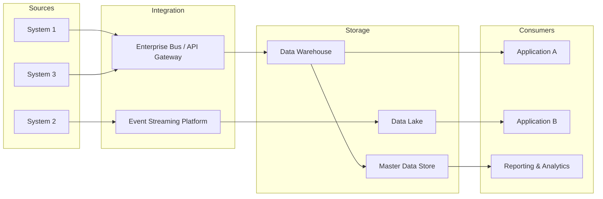

# Data Architecture — TOGAF ADM Phase C.2

## Document Control

| Field | Value |
|-------|-------|
| Document ID | `ARC-[PROJECT_ID]-DATA-v[VERSION]` |
| Project | `[PROJECT_NAME]` |
| Owner | `[OWNER_NAME_AND_ROLE]` |
| Classification | `[CLASSIFICATION]` |
| Status | DRAFT |
| Created | `[YYYY-MM-DD]` |
| Review Date | `[YYYY-MM-DD]` |

### Revision History

| Version | Date | Author | Description | Reviewer | Approver |
|---------|------|--------|-------------|----------|----------|
| `[VERSION]` | `[YYYY-MM-DD]` | ArcKit AI | Initial creation from `/arckit:data-architecture` command | `[REVIEWER_NAME]` | `[APPROVER_NAME]` |

---

## 1. Data Architecture Vision

[2-3 paragraph narrative articulating the target data architecture state]

[Reference business drivers, data strategy goals, and alignment with enterprise architecture principles]

---

## 2. Data Entities Catalog

### 2.1 Data Domains

| Domain | Description | Owner | Classification |
|--------|-------------|-------|----------------|
| `[Domain 1]` | [Description] | `[Business Owner]` | `[Classification]` |
| `[Domain 2]` | [Description] | `[Business Owner]` | `[Classification]` |
| `[Domain 3]` | [Description] | `[Business Owner]` | `[Classification]` |

### 2.2 Data Entities by Domain

#### Domain 1: [Domain Name]

| Entity ID | Entity Name | Attributes | Data Type | Cardinality | Owner | Sensitivity |
|-----------|-----------|-----------|-----------|------------|-------|------------|
| `[DE-001]` | [Entity Name] | `[attr1, attr2, attr3]` | [Type] | [1:1 / 1:N / M:N] | `[Owner]` | [Low/Medium/High/Critical] |
| `[DE-002]` | [Entity Name] | `[attr1, attr2, attr3]` | [Type] | [1:1 / 1:N / M:N] | `[Owner]` | [Low/Medium/High/Critical] |

#### Domain 2: [Domain Name]

| Entity ID | Entity Name | Attributes | Data Type | Cardinality | Owner | Sensitivity |
|-----------|-----------|-----------|-----------|------------|-------|------------|
| `[DE-003]` | [Entity Name] | `[attr1, attr2, attr3]` | [Type] | [1:1 / 1:N / M:N] | `[Owner]` | [Low/Medium/High/Critical] |
| `[DE-004]` | [Entity Name] | `[attr1, attr2, attr3]` | [Type] | [1:1 / 1:N / M:N] | `[Owner]` | [Low/Medium/High/Critical] |

### 2.3 Data Entity Relationships

[Description of key relationships between entities across domains]

---

## 3. Data Governance Framework

### 3.1 Data Stewardship Model

| Role | Responsibility | Accountable | Consulted | Informed |
|------|---------------|-------------|-----------|----------|
| Data Owner | Strategic data decisions | `[Role]` | `[Role]` | `[Role]` |
| Data Steward | Day-to-day data quality | `[Role]` | `[Role]` | `[Role]` |
| Data Custodian | Technical data management | `[Role]` | `[Role]` | `[Role]` |
| Data Consumer | Data usage compliance | `[Role]` | `[Role]` | `[Role]` |

### 3.2 Data Quality Standards

| Standard | Definition | Threshold | Measurement |
|----------|-----------|-----------|-------------|
| Completeness | Percentage of mandatory fields populated | `[> 95%]` | [Frequency of assessment] |
| Accuracy | Data correctly represents the real-world entity | `[> 99%]` | [Validation method] |
| Consistency | Data is uniform across systems | `[100%]` | [Cross-system reconciliation] |
| Timeliness | Data is available within required timeframe | `[< X hours]` | [Latency measurement] |
| Validity | Data conforms to defined rules and formats | `[100%]` | [Format validation] |

### 3.3 Data Classification Scheme

| Classification | Description | Handling Requirements | Retention Period |
|----------------|-------------|-----------------------|------------------|
| Public | No sensitivity restrictions | Standard handling | `[Period]` |
| Internal | Internal use only | Access controlled | `[Period]` |
| Confidential | Sensitive business information | Encrypted at rest and in transit | `[Period]` |
| Restricted | Highly sensitive / regulated data | Strict access control, audit logging | `[Period]` |

### 3.4 Data Retention Policy

| Data Class | Retention Period | Legal Basis | Disposition |
|------------|-----------------|-------------|-------------|
| `[Class 1]` | `[X years]` | `[Regulation/Policy]` | `[Secure deletion / Archive]` |
| `[Class 2]` | `[X years]` | `[Regulation/Policy]` | `[Secure deletion / Archive]` |
| `[Class 3]` | `[X years]` | `[Regulation/Policy]` | `[Secure deletion / Archive]` |

---

## 4. Data Management Strategy

### 4.1 Data Lifecycle

| Stage | Description | Controls | Duration |
|-------|-------------|----------|----------|
| Creation | Data is generated or ingested | [Validation, classification] | — |
| Active Use | Data is processed and consumed | [Access control, encryption] | `[Period]` |
 | Archival | Data is moved to cold storage | [Immutability, compliance hold] | `[Period]` |
| Destruction | Data is permanently deleted | [Verification, audit trail] | — |

### 4.2 Integration Patterns

| Pattern | Use Case | Example |
|---------|----------|---------|
| Point-to-Point | Simple, low-volume data exchanges | [Application] → [Application] |
| Hub-and-Spoke | Centralised data integration | Enterprise Service Bus |
| Event-Driven | Real-time data propagation | Event streaming platform |
| Data Pipeline | Batch data processing | ETL/ELT pipelines |

### 4.3 Data Flow Architecture



---

## 5. Reference & Master Data

### 5.1 Master Data Entities

| Entity | Golden Record Source | Reconciling Systems | Match Rate Target |
|--------|---------------------|-------------------|-------------------|
| Customer | `[System]` | `[Systems]` | `[> 99%]` |
| Product | `[System]` | `[Systems]` | `[> 99%]` |
| Employee | `[System]` | `[Systems]` | `[100%]` |
| Location | `[System]` | `[Systems]` | `[100%]` |

### 5.2 Shared Data Definitions

| Field Name | Data Type | Format | Valid Values | Source System |
|-----------|-----------|--------|-------------|---------------|
| `[field_1]` | [Type] | [Format] | [Enumerated / Range] | [System] |
| `[field_2]` | [Type] | [Format] | [Enumerated / Range] | [System] |
| `[field_3]` | [Type] | [Format] | [Enumerated / Range] | [System] |

### 5.3 Standard Code Sets

| Code Set | Domain | Format | Example |
|----------|--------|--------|---------|
| Country Codes | Geographic | ISO 3166-1 alpha-2 | GB, US, DE |
| Currency Codes | Financial | ISO 4217 | GBP, USD, EUR |
| Status Codes | Operational | [Custom format] | ACTIVE, PENDING, CLOSED |

---

## 6. Data Architecture Principles

| Principle ID | Principle | Description | Rationale |
|-------------|-----------|-------------|-----------|
| `[DP-001]` | [Principle Name] | [Description] | [Why this matters] |
| `[DP-002]` | [Principle Name] | [Description] | [Why this matters] |
| `[DP-003]` | [Principle Name] | [Description] | [Why this matters] |

---

## 7. Data Domain Map

```mermaid
C4Context
    title Data Domain Map — [Project Name]

    Person(customer, "Customer", "Data Consumer")
    Person(admin, "Administrator", "Data Manager")

    System_Boundary(data_domains, "Data Domains")
        System_Boundary(customer_domain, "Customer Data")
            System(customer_db, "Customer Database", "Primary customer records")
        System_Boundary(finance_domain, "Financial Data")
            System(finance_db, "Financial Database", "Transaction and billing data")
        System_Boundary(operations_domain, "Operational Data")
            System(ops_db, "Operations Database", "Process and workflow data")
        System(master_data, "Master Data Store", "Golden records & reference data")

    Rel(customer, customer_db, "Queries")
    Rel(customer, master_data, "Reads reference data")
    Rel(admin, master_data, "Manages master data")
    Rel(customer_db, master_data, "Enriches with master data")
    Rel(finance_db, master_data, "References master data")
    Rel(ops_db, master_data, "References master data")
```

---

## 8. Traceability

| Data Element | Source Artifact | Link | Traceability Note |
|-------------|----------------|------|-------------------|
| Data Domains | BPCM: `[Section]` | `ARC-[P]-BPCM-v[N].md` | Mapped to capability areas |
| Data Entities | APP: `[Section]` | `ARC-[P]-APP-v[N].md` | Mapped to application data stores |
| Data Principles | PRIN: `[Section]` | `ARC-000-PRIN-v[N].md` | Derived from enterprise principles |
| Governance | External: `[Document]` | `[Reference]` | Compliance requirements |

### External References

| ID | Source | Relevance |
|----|--------|-----------|
| `[DA-E1]` | [External document name] | [What it contributed] |

---

## 9. Assumptions

1. [Assumption about current data state]
2. [Assumption about data migration feasibility]
3. [Assumption about data governance maturity]
4. [Assumption about tooling availability]

---

## 10. Risks

| # | Risk | Impact | Mitigation |
|---|------|--------|------------|
| 1 | [Risk] | [Impact] | [Mitigation] |
| 2 | [Risk] | [Impact] | [Mitigation] |
| 3 | [Risk] | [Impact] | [Mitigation] |

---

**Generated by**: ArcKit `/arckit:data-architecture` command
**Generated on**: `[DATE] [TIME] GMT`
**ArcKit Version**: `{ARCKIT_VERSION}`
**Project**: `[PROJECT_NAME]` (Project `[PROJECT_ID]`)