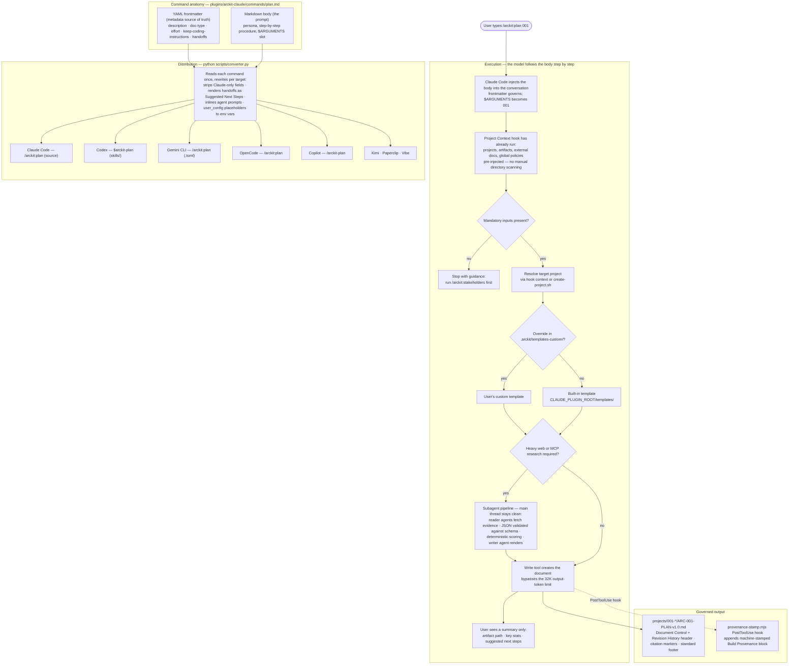

# ArcKit: The Enterprise Architecture Governance Harness

**Build better enterprise architecture through structured strategy, design, delivery, and assurance workflows.**

ArcKit is a toolkit for enterprise architects that transforms architecture governance from scattered documents into a systematic, AI-assisted workflow for:

- 🏛️ Establishing and enforcing architecture principles
- 👥 Analyzing stakeholder drivers, goals, and outcomes
- 🛡️ Risk management (HM Treasury Orange Book)
- 💼 Business case justification (HM Treasury Green Book SOBC)
- 📋 Creating comprehensive requirements documents
- 🗄️ Data modeling with ERD, GDPR compliance, and data governance
- 🔬 Technology research with build vs buy analysis (web search powered)
- ☁️ Azure-specific research using Microsoft Learn MCP for authoritative documentation
- 🗺️ Strategic planning with Wardley Mapping
- 📊 Generating visual architecture diagrams (Mermaid)
- 🤝 Managing vendor RFP and selection processes
- ✅ Conducting formal design reviews (HLD/DLD)
- 🔧 ServiceNow service management design
- 🔗 Maintaining requirements traceability
- 📎 Citation traceability for external documents (inline `[DOC-CN]` markers with source quotes)

---

## Quick Start

Three ways to run ArcKit - pick the one that fits your workflow:

1. **Claude Code plugin** - the premier experience: 75 core commands, 16 marketplace plugins, autonomous research agents, automation hooks, bundled MCP servers, automatic updates.
2. **Codex CLI** - scaffold a project with `arckit init --ai codex`, then drive ArcKit skills inside Codex.
3. **Bring Your Own LLM** - run `arckit build` recipes against any local or remote OpenAI-compatible endpoint.

### Claude Code

Claude Code is the **primary development platform** for ArcKit: all official commands, autonomous research agents, automation hooks, bundled MCP servers (AWS Knowledge, Microsoft Learn, Google Developer Knowledge, Data Commons, govreposcrape, uk-tenders), and automatic updates via the marketplace. Requires Claude Code **v2.1.219+**.

```bash
# Make sure Claude Code is on the latest version
claude install latest
```

Then in Claude Code, add the ArcKit marketplace:

```text
/plugin marketplace add terrygzhou/arc-kit
```

The marketplace ships **17 plugins** - install the core plus only the overlays you need:

```bash
# Core (75 commands - UK Government civilian + generic enterprise)
claude plugin install arckit@arc-kit

# Core + UAE federal
claude plugin install arckit arckit-uae

# Broad overlay set (UK + UAE + FR + CA + EU + AT + AU + US + UK-NHS + UK-GCloud)
claude plugin install arckit arckit-{uae,fr,ca,eu,at,au,us,uk-nhs,uk-gcloud}

# Enterprise architecture and AI agent governance overlays
claude plugin install arckit arckit-togaf-adm arckit-oaa arckit-agent-architecture
```

No project initialization is needed - the plugin provides everything. Use the commands directly:

```text
/arckit:principles Create principles for a financial services company
/arckit:requirements Build a payment processing system...
/arckit:sow Generate RFP for vendor selection
```

Updates are automatic via the marketplace - no action needed.

### Codex CLI

Two ways to install - pick the one that fits:

**Option 1: Codex plugin (simplest)** - no Python, no project scaffolding. One-time setup, works in any project:

```bash
# Prereq: Node.js for the lifecycle hooks (on macOS: brew install node)
codex plugin marketplace add terrygzhou/arckit-codex
codex features enable hooks
codex features enable plugin_hooks
```

Restart Codex, open `/plugins`, choose **ArcKit Plugins**, then install and enable **ArcKit**. For each project:

```bash
mkdir my-arch && cd my-arch && git init
codex
```

```text
$arckit-init        Create the projects/ structure (once per repo)
$arckit-start       Guided onboarding - tells you what comes next
$arckit-principles  Create principles for a financial services company
```

All artifacts land as versioned Markdown (`ARC-NNN-TYPE-vN.N.md`) under `projects/` - just commit regularly. To upgrade later: `codex plugin marketplace upgrade arckit`.

**Option 2: ArcKit CLI** - scaffold a full project workspace with templates, schemas, and helper scripts:

Install the ArcKit CLI:

```bash
# Install with pip
pip install git+https://github.com/terrygzhou/arc-kit.git

# Or with uv
uv tool install arckit-cli --from git+https://github.com/terrygzhou/arc-kit.git

# Or run without installing
uvx --from git+https://github.com/terrygzhou/arc-kit.git arckit init my-project
```

Scaffold a project - this creates `.agents/skills/` (auto-discovered by Codex), `.codex/agents/`, `.codex/hooks/`, `.codex/config.toml` (MCP servers + hook wiring), `.arckit/templates/`, and helper scripts:

```bash
# Create a new architecture governance project
arckit init payment-modernization --ai codex

# Minimal install (skip docs and guides)
arckit init payment-modernization --ai codex --minimal

# Or initialize in the current directory
arckit init . --ai codex
```

Start Codex and use the ArcKit skills:

```bash
cd payment-modernization
codex
```

```text
/arckit:principles Create principles for a financial services company
/arckit:requirements Build a payment processing system...
/arckit:sow Generate RFP for vendor selection
```

**Upgrading** (Option 2) - upgrade the CLI, then re-run `init` in place:

```bash
# Step 1: Upgrade the CLI tool
pip install --upgrade git+https://github.com/terrygzhou/arc-kit.git
# Or with uv:
uv tool upgrade arckit-cli --from git+https://github.com/terrygzhou/arc-kit.git

# Step 2: Update your existing project (re-run init in place)
cd /path/to/your-existing-project
arckit init --here --ai codex
```

This updates commands, templates, scripts, and agents while **preserving** your project data (`projects/`) and custom templates (`.arckit/templates-custom/`).

If upgrading from v0.x, you may also need to migrate legacy filenames - see the [upgrading guide](docs/guides/upgrading.md) for full details.

### Bring Your Own LLM

Run `arckit build` against any local or remote OpenAI-compatible endpoint:

```bash
# One-shot via flags (trailing /v1 is auto-stripped)
arckit build my-project --base-url http://127.0.0.1:8080 --model Qwen3.6-27B

# Persistent config (arckit config)
arckit config set llm.base_url http://127.0.0.1:8080
arckit config set llm.model Qwen3.6-27B
```

**Presets** — `arckit local setup` includes a wizard with common local endpoints (Ollama, SGLang, vLLM). SGLang on port 8080 is a built-in preset.

**Retry behaviour** — failed LLM calls retry with exponential backoff (2s → 4s → 8s) before failing the wave. Configure via `--base-url` and `--model` per-build, or persist via `arckit config`.

### Platform Support

| Platform | Claude Code Plugin | GitHub Copilot | Codex / OpenCode CLI | Mistral Vibe | Kimi Code CLI |
|----------|-------------------|----------------|---------------------|--------------|----------------|
| macOS | Full support | Full support | Full support | Full support | Full support |
| Linux | Full support | Full support | Full support | Full support | Full support |
| Windows (WSL2) | Full support | Full support | Full support | Full support | Full support |
| Windows (native) | Full support | Full support | Partial | Full support | Full support |

**Windows users**: The Claude Code plugin, GitHub Copilot prompt files, Mistral Vibe extension, and Kimi Code CLI extension work natively on all platforms. For Codex CLI / OpenCode CLI on native Windows (without WSL), some commands containing inline bash snippets may require [Git Bash](https://git-scm.com/downloads/win) or [WSL2](https://learn.microsoft.com/en-us/windows/wsl/install). We recommend WSL2 for the best experience.

---

## Why ArcKit?

### Problem: Architecture Governance is Broken

Traditional enterprise architecture suffers from:

- ❌ Scattered documents across tools (Word, Confluence, PowerPoint)
- ❌ Inconsistent governance enforcement
- ❌ Manual vendor evaluation with bias
- ❌ Lost traceability between requirements and design
- ❌ Stale documentation that doesn't match reality

### Solution: Structured, AI-Assisted Governance

ArcKit provides:

- ✅ **Template-Driven Quality**: Comprehensive templates ensure nothing is forgotten
- ✅ **Systematic Workflows**: Clear processes from requirements → procurement → design review
- ✅ **AI Assistance**: Let AI handle document generation, you focus on decisions
- ✅ **Enforced Traceability**: Automatic gap detection and coverage analysis
- ✅ **Version Control**: Git-based workflow for all architecture artifacts

---

## TOGAF ADM Overlay (`arckit-togaf-adm`) [COMMUNITY]

Enterprise Architecture Development Method — 9 commands covering the full ADM cycle.

| Command | Doc Type | Phase | Description |
|---------|----------|-------|-------------|
| `/arckit:adm-preliminary` | ADMP | Preliminary | Architecture vision, scope, drivers, constraints |
| `/arckit:business-capability-map` | BPCM | Phase A | Business capability hierarchy, value streams, maturity |
| `/arckit:application-inventory` | APP | Phase C | Application catalog with strategic fit scoring |
| `/arckit:application-rationalization` | APPR | Phase C | Keep/merge/replace/retire decisions |
| `/arckit:gap-analysis` | GAPA | Phase E | Capability gap matrix, workstream mapping |
| `/arckit:transition-architecture` | TRANS | Phase F | Work packages, migration waves, acceptance criteria |
| `/arckit:architecture-board` | BORD | Phase G | Board charter, compliance scorecard, governance |
| `/arckit:architecture-change` | ACHG | Phase H | Change requests, ADM cycle re-entry |
| `/arckit:architecture-repository` | REPO | Repository | Patterns, standards, reference architectures |

**Install:** `claude plugin install arckit arckit-togaf-adm`
**Recipe:** `togaf-adm-full` — full ADM cycle via build recipe

---

## O-AA Overlay (`arckit-oaa`) [COMMUNITY]

Open Agile Architecture (C208) — sprint-based, product-driven architecture delivery. 5 commands that compress the ADM cycle into 2–4 week engagement windows.

| Command | Doc Type | C208 Chapter | Description |
|---------|----------|-------------|-------------|
| `/arckit:oaa-adm-lite` | `OAAL` | Ch 1–9 | Maps TOGAF ADM cycle to agile sprints with backlog-driven delivery |
| `/arckit:product-architecture` | `OAPR` | Ch 12 | Product-centric architecture — cross-functional teams, value streams, backlog-driven |
| `/arckit:agile-strategy` | `OASTR` | Ch 10 | Dual transformation canvas — legacy modernization + greenfield innovation |
| `/arckit:agile-security` | `OASEC` | Ch 17 | Security as backlog items — per-sprint threat modeling, continuous compliance |
| `/arckit:agile-governance` | `OAGOV` | Ch 18 | Sprint-aligned governance — lightweight review gates, max 2 artefacts per sprint |

**Install:** `claude plugin install arckit arckit-oaa`
**Recipe:** `oaa-full` — strategy → product → ADM Lite → security → governance pipeline
**Requires:** `arckit` core plugin (recipe resolves `arckit:principles`, `arckit:requirements`, `arckit:stakeholders`)

---

## AI Agent Architecture Overlay (`arckit-agent-architecture`) [COMMUNITY]

Governance, design, and security for autonomous AI agent programs — 6 commands.

| Command | Doc Type | Description |
|---------|----------|-------------|
| `/arckit:agent-inventory` | AAGI | Agent catalog with capabilities, security classification |
| `/arckit:agent-design` | AAGR | Agent architecture spec — patterns, tools, memory, orchestration |
| `/arckit:agent-governance` | AAOV | Oversight models, approval workflows, audit, compliance |
| `/arckit:agent-integration` | AAIN | Multi-agent orchestration, contracts, shared state |
| `/arckit:agent-security` | AASE | Sandboxing, permissions, injection defences, output validation |
| `/arckit:agent-maturity` | AAMT | 5×5 maturity model for agent programs |

**Install:** `claude plugin install arckit arckit-agent-architecture`
**Recipe:** `agent-architecture` — full agent architecture lifecycle via build recipe

### Combined Recipe: `togaf-agent-full`

For organisations adopting both enterprise architecture and AI agent governance:

```bash
claude agent recipes/togaf-agent-full.yaml
```

---

## The ArcKit Workflow

ArcKit guides you through the enterprise architecture lifecycle in gated phases. Each phase maps to one or more commands:

### Phase 0: Project Planning

**`/arckit:plan`** → Create the project plan.

- GDS Agile Delivery phases (Discovery → Alpha → Beta → Live)
- Mermaid Gantt chart with timeline, dependencies, and milestones
- Workflow diagram showing gates and decision points
- Complexity-tailored timeline with gate approval criteria for governance

### Phase 1: Establish Governance

**`/arckit:principles`** → Define the organisation's architecture principles: cloud strategy (AWS/Azure/GCP), security frameworks, technology standards, and FinOps/cost governance.

### Phase 2: Stakeholder Analysis

**`/arckit:stakeholders`** → Run **before the business case** to understand who cares about the project and why.

- Identify stakeholders and document underlying drivers (strategic, operational, financial, compliance, risk)
- Map drivers → SMART goals → measurable outcomes with full traceability
- Identify conflicts and synergies; define engagement and communication strategies

### Phase 3: Risk Assessment

**`/arckit:risk`** → Create the Orange Book risk register. Run **before the business case** to identify and assess risks systematically.

- HM Treasury Orange Book 2023 framework across 6 categories
- Inherent (before controls) vs residual (after controls) assessment; 4Ts responses (Tolerate, Treat, Transfer, Terminate)
- Every risk linked to a RACI stakeholder; feeds SOBC Management Case Part E

### Phase 4: Business Case Justification

**`/arckit:sobc`** → Create the Strategic Outline Business Case. Run **before requirements** to justify investment and secure approval.

- Green Book 5-case model (Strategic, Economic, Commercial, Financial, Management)
- Strategic options analysis; benefits mapped to stakeholder goals; ROM cost estimates
- Go/no-go decision before detailed requirements work

### Phase 5: Define Requirements

**`/arckit:requirements`** → Document comprehensive requirements informed by stakeholder goals.

- Business, functional (with acceptance criteria), non-functional, integration, and data requirements (DR-xxx)
- Success criteria and KPIs

### Phase 5.3: Platform Strategy Design (Optional - for Multi-Sided Platforms)

**`/arckit:platform-design`** → Design multi-sided platform strategy with the Platform Design Toolkit. For ecosystem-based platforms (Government as a Platform, marketplaces, data platforms): Ecosystem Canvas, entity/role portraits, motivations matrix, transactions board with cost-reduction analysis, learning engine, MVP liquidity bootstrapping, and the full 8-canvas synthesis. Aligned with GaaP and TCoP Point 8. Use cases: NHS appointment booking, local authority data marketplaces, training procurement, citizen service portals.

### Phase 5.5: Data Modeling

**`/arckit:data-model`** → Create the data model from DR-xxx requirements.

- Mermaid Entity-Relationship Diagram with entity catalog (attributes, types, validation rules)
- PII identification, access patterns, data quality framework, and DR-xxx → entity → attribute traceability

### Phase 5.7: Data Protection Impact Assessment

**`/arckit:dpia`** → Generate the [DPIA](https://ico.org.uk/for-organisations/uk-gdpr-guidance-and-resources/accountability-and-governance/data-protection-impact-assessments-dpias/) for UK GDPR Article 35. **Mandatory for high-risk processing.**

- ICO 9-criteria screening, auto-populated from the data model (entities, PII, lawful basis)
- Privacy impact assessment, data subject rights checklist, AI/ML processing assessment
- International transfer safeguards, bidirectional links to the risk register

### Phase 5.8: Data Source Discovery

**`/arckit:datascout`** → Discover and evaluate external data sources to fulfil data requirements.

- UK Government open data portals, commercial APIs, and open source datasets
- Weighted scoring (requirements fit, quality, license/cost, API quality, compliance, reliability) and gap analysis
- Every DR-xxx mapped to a source or flagged as a gap (TCoP Point 10)

### Phase 6: Technology Research

**`/arckit:research`** → Research solutions with build vs buy analysis: commercial SaaS and open source options, GOV.UK platforms, Digital Marketplace suppliers, 3-year TCO comparison, Wardley evolution positioning, and cost data feeding the SOBC Economic Case.

### Phase 6.5: Grants & Funding Research

**`/arckit:grants`** → Research UK grants (Innovate UK, UKRI), charitable funding, and accelerator programmes with eligibility scoring, application timelines, and a structured GRNT funding opportunity register.

### Phase 7: Strategic Planning with Wardley Mapping

**`/arckit:wardley`** → Create strategic Wardley Maps.

- Component evolution analysis (Genesis → Custom → Product → Commodity) and build vs buy framework
- Vendor comparison, Digital Marketplace mapping, and evolution predictions

### Phase 7.5: Strategic Roadmap

**`/arckit:roadmap`** → Create a multi-year architecture roadmap for transformation programs.

- 3-5 year Mermaid Gantt aligned to financial years, with strategic themes and capability evolution (L1 → L5)
- CAPEX/OPEX investment planning, governance cadence (ARB, Programme Board, Steering Committee), and dependency/critical-path flowchart
- Strategic and multi-initiative; use `/arckit:plan` for tactical single-initiative delivery

### Phase 7.6: Architecture Strategy Synthesis

**`/arckit:strategy`** → Synthesise strategic artifacts into an executive-level Architecture Strategy: vision, drivers, current/target state, technology evolution, strategic themes, investment and risk summary, KPIs, and full driver → goal → outcome → theme → KPI traceability. The only ArcKit command with two mandatory inputs (principles AND stakeholders).

### Phase 7.7: Architecture Decision Records

**`/arckit:adr`** → Document decisions in MADR v4.0 format enhanced for UK Government.

- Sequential numbering, status, and escalation level; stakeholder RACI; decision drivers
- Options analysis (2-3 options + Do Nothing) with cost and Service Standard impact; Y-Statement justification
- Consequences, validation plan, traceability, and governance forums (ARB, TDA, Programme Board)

### Phase 8: Vendor Procurement (if needed)

- **`/arckit:sow`** → RFP-ready Statement of Work: scope, technical requirements, vendor qualifications, evaluation criteria, contract terms.
- **`/arckit:dos`** → UK Digital Outcomes and Specialists procurement: essential/desirable skills, success criteria, 40/30/20/10 evaluation framework, audit-ready for Digital Marketplace.
- **`/arckit:gcloud-search`** → G-Cloud requirements document plus live Digital Marketplace search with a service comparison table and top 3-5 shortlist.
- **`/arckit:gcloud-clarify`** → G-Cloud gap analysis (✅ Confirmed / ⚠️ Ambiguous / ❌ Not mentioned) with prioritised supplier clarification questions and risk matrix.
- **`/arckit:evaluate`** → Vendor evaluation framework (100-point technical scoring, cost methodology, reference checks) with a side-by-side proposal comparison mode.

### Phase 9: Design Review

- **`/arckit:hld-review`** → High-Level Design review: principles compliance, requirements coverage, security, scalability, operational readiness.
- **`/arckit:dld-review`** → Detailed Design review: component specifications, OpenAPI contracts, database schemas, security implementation, test strategy.

### Phase 10: Sprint Planning

**`/arckit:backlog`** → Generate the prioritised product backlog after HLD approval, before Sprint 1.

- GDS-format user stories with MoSCoW + risk + value + dependency prioritization and sprint capacity balancing
- Traceability matrix and export to Jira/Azure DevOps (CSV) or JSON
- Typical time savings: 75%+ (4-6 weeks → 3-5 days)

### Phase 10.5: Backlog Export

**`/arckit:trello`** → Push the backlog to Trello: sprint-based lists, cards with MoSCoW labels and acceptance-criteria checklists, rate-limit-aware API integration. Requires `TRELLO_API_KEY` and `TRELLO_TOKEN`.

### Phase 11: ServiceNow Service Management Design

**`/arckit:servicenow`** → Bridge architecture to operations: CMDB design from diagrams, SLAs from NFRs, incident and change management, monitoring and alerting, and service transition plans.

### Phase 12: Traceability

**`/arckit:traceability`** → Generate the traceability matrix: requirements → design → test mapping with gap/orphan detection and change impact tracking.

### Phase 13: Quality Assurance

**`/arckit:analyze`** → Periodic governance quality analysis across principles compliance, requirements coverage, stakeholder alignment, risk completeness, design review quality, and documentation — with gap identification and recommendations. Run before milestones, design reviews, or procurement decisions.

### Phase 14: Compliance Assessment (UK Government)

For UK Government and public sector projects:

- **`/arckit:service-assessment`** → [GDS Service Standard](https://www.gov.uk/service-manual/service-assessments) prep: evidence against all 14 points, RAG ratings, readiness score, and prioritised gap remediation for alpha/beta/live assessments.
- **`/arckit:tcop`** → [Technology Code of Practice](https://www.gov.uk/guidance/the-technology-code-of-practice) assessment across all 13 points (user needs, accessibility, open source, open standards, cloud first, security, privacy, share/reuse, integration, data, purchasing, Digital Spend Controls, responsible AI).
- **`/arckit:secure`** → Secure by Design assessment: NCSC Cloud Security Principles, NCSC CAF, Cyber Essentials (Plus), UK GDPR/DPA 2018, security architecture review, threat modeling.
- **`/arckit:ai-playbook`** → [UK AI Playbook](https://www.gov.uk/government/publications/ai-playbook-for-the-uk-government) responsible AI assessment: ethics, transparency, bias mitigation, AI data governance, human oversight, impact assessment.
- **`/arckit:atrs`** → [ATR recording](https://www.gov.uk/government/collections/algorithmic-transparency-recording-standard-hub) for algorithmic decision-making: algorithm details, data sources/quality, performance metrics, impact and mitigation.

For MOD projects:

- **`/arckit:mod-secure`** → MOD Secure by Design: JSP 440, IAMM, clearances and vetting, STRAP classification handling, SyOPs, supplier attestation.
- **`/arckit:jsp-936`** → [MOD JSP 936](https://www.gov.uk/government/publications/jsp-936-dependable-artificial-intelligence-ai-in-defence-part-1-directive) AI assurance: 5 ethical principles, 5 risk levels, 8 lifecycle phases, approval pathways, RAISO/ethics governance, human-AI teaming.

### Phase 14.5: Compliance Assessment (EU and French Government)

For organisations operating in the EU or under French jurisdiction — public sector or private:

- **`/arckit:eu-rgpd`** → GDPR (Regulation 2016/679): legal basis determination, data subject rights, CNIL registration and DPO obligations, cross-border transfer safeguards, DPIA integration.
- **`/arckit:eu-ai-act`** → EU AI Act (Regulation 2024/1689): risk classification, high-risk system and GPAI obligations, prohibited practices, fundamental rights impact assessment.
- **`/arckit:eu-nis2`** → NIS2 Directive (2022/2555): essential/important entity classification, French OIV/OSE designation, governance and incident reporting (ANSSI 24h → 72h → 30-day final), supply chain security.
- **`/arckit:eu-dora`** → DORA (Regulation 2022/2554) for financial entities: 5-pillar ICT risk management, incident classification and reporting, TLPT, third-party ICT provider management.
- **`/arckit:eu-cra`** → Cyber Resilience Act (Regulation 2024/2847) for products with digital elements: product classification, Annex I Part I security-by-design, mandatory SBOM (SPDX/CycloneDX), 24h ENISA reporting; fully applicable from 11 December 2027.
- **`/arckit:eu-dsa`** → Digital Services Act (Regulation 2022/2065): provider tiers up to VLOP/VLOSE (45M EU users), content moderation and recommender transparency, systemic risk audits.
- **`/arckit:eu-data-act`** → Data Act (Regulation 2023/2854): role determination, user data access and B2B sharing, cloud switching (egress fees end September 2027), transfer restrictions; applies from 12 September 2025.

---

### Phase 15: Project Story & Reporting

- **`/arckit:story`** → Narrative project record: 4 timeline visualizations with metrics, complete event timeline, 8 narrative chapters, end-to-end traceability demonstration, governance achievements, and appendices (artifact register, activity log, glossary). Share with stakeholders, leadership, or at portfolio reporting.
- **`/arckit:presentation`** → MARP slide deck (`PRES`) from project artifacts: focus modes (Executive/Technical/Stakeholder/Procurement), embedded Mermaid diagrams, configurable slide count (6-20) and theme. Run before boards, briefings, and gate reviews.

### Phase 16: Documentation Publishing

**`/arckit:pages`** → Publish all project documentation as an interactive static site (`docs/index.html` + `docs/manifest.json`), deployable to any static host.

- Inline Mermaid rendering, collapsible project navigation with version selectors, GOV.UK styling
- Programmatic document index via manifest.json; `docs/llms.txt` for LLM discovery (hand-curated files preserved on re-runs)

---

## Supported AI Assistants

| Assistant | Support | Notes |
|-----------|---------|-------|
| [Claude Code](https://www.anthropic.com/claude-code) | ✅ Premier | **Primary platform.** Plugin with agents, hooks, MCP servers, and auto-updates |
| [GitHub Copilot](https://github.com/features/copilot) | ✅ Core | VS Code prompt files, custom agents, and repo-wide instructions (`arckit init --ai copilot`) |
| [OpenAI Codex CLI](https://chatgpt.com/features/codex) | ✅ Core | CLI with commands and templates. ChatGPT Plus/Pro/Enterprise ([Setup Guide](.codex/README.md)) |
| [OpenCode CLI](https://opencode.net/cli) | ✅ Core | CLI with commands and templates |

> **Platform Support**: ArcKit is developed and tested on **Linux**. Windows has limited support — hooks (session init, project context, filename validation, MCP auto-allow) require bash and jq which are not available on stock Windows. For the best experience on Windows, use a **devcontainer** or **WSL2**.

### Why Claude Code?

Claude Code is the **primary development platform** for ArcKit and provides capabilities not available in other formats:

| Feature | Claude Code | Copilot | Codex / OpenCode |
|---------|:-----------:|:-------:|:----------------:|
| 75 cross-AI slash commands | ✅ | ✅ | ✅ |
| `/arckit:build` parallel build harness (Claude-only — depends on parallel `Agent` dispatch) | ✅ | — | — |
| Templates & scripts | ✅ | ✅ | ✅ |
| Bundled MCP servers (AWS, Azure, GCP, DataCommons, govreposcrape, uk-tenders) | ✅ | — | Manual setup |
| **Autonomous research agents** (10 agents for research, datascout, cloud research, gov code discovery, grants, framework) | ✅ | ✅ (10 agents) | — |
| **SessionStart hook** (auto-detect version + projects) | ✅ | — | — |
| **UserPromptSubmit hook** (project context injection on every prompt) | ✅ | — | — |
| **PreToolUse hook** (ARC filename auto-correction) | ✅ | — | — |
| **PermissionRequest hook** (auto-allow MCP documentation tools) | ✅ | — | — |
| **Per-command Stop hooks** (output validation, e.g. Wardley Map math checks) | ✅ | — | — |
| Wardley Mapping skill (with Pinecone MCP book corpus) | ✅ | — | — |
| Mermaid Syntax Reference skill (23 diagram types + config) | ✅ | — | ✅ |
| Automatic marketplace updates | ✅ | Manual reinstall | Manual reinstall |
| Zero-config installation | ✅ | `arckit init` required | `arckit init` required |

**Agents** run research-heavy commands (market research, data source discovery, cloud service evaluation) in isolated context windows, keeping the main conversation clean and enabling dozens of WebSearch/WebFetch/MCP calls without context bloat.

**Hooks** provide automated governance: filenames are auto-corrected to ArcKit conventions, project context is injected into every prompt so commands know what artifacts exist, MCP tools are auto-approved, and generated outputs like Wardley Maps are validated for mathematical consistency before being finalized.

GitHub Copilot provides all 75 official commands as prompt files and 10 custom agents but lacks hooks and MCP servers. Codex CLI and OpenCode CLI provide core command functionality but require manual setup and `arckit init` scaffolding.

### Why Commands, Not Skills

Claude Code automatically exposes ArcKit commands as **skills** (they appear in the skills list and can be matched by natural language). ArcKit intentionally uses **slash commands** rather than standalone skills because:

- **Deliberate invocation required** — Every command generates a heavyweight governance document (requirements spec, risk register, DPIA, etc.). Auto-triggering from conversational intent would waste significant time and tokens.
- **Dependency ordering** — Commands follow a deliberate sequence (principles → stakeholders → requirements → data-model → etc.). Skills that auto-trigger could run out of order.
- **User input via `$ARGUMENTS`** — Most commands accept context from the user (project name, scope, constraints). The command system handles this with `$ARGUMENTS` substitution.
- **Best of both worlds** — Since Claude Code exposes commands as skills automatically, users get explicit `/arckit:requirements` invocation AND natural language matching when Claude recognises intent — no restructuring needed.

The diagram below traces a command's full lifecycle — from invocation through governance checks, generation, machine-stamped output, and distribution to other AI assistants:



### Using with GitHub Copilot

For GitHub Copilot users in VS Code, ArcKit commands are delivered as prompt files and custom agents:

```bash
# Install and create project (3 steps, zero config)
pip install git+https://github.com/terrygzhou/arc-kit.git
arckit init my-project --ai copilot
cd my-project && code .

# Then use ArcKit commands in Copilot Chat
/arckit-principles Create principles for financial services
/arckit-stakeholders Analyze stakeholders for cloud migration
/arckit-requirements Create comprehensive requirements
```

This creates `.github/prompts/arckit-*.prompt.md`, `.github/agents/arckit-*.agent.md` (10 custom agents), and `.github/copilot-instructions.md` (repo-wide context).

### Using with Codex CLI

For OpenAI Codex CLI users, ArcKit commands are delivered as skills and auto-discovered:

```bash
# Install and create project (3 steps, zero config)
pip install git+https://github.com/terrygzhou/arc-kit.git
arckit init my-project --ai codex
cd my-project && codex

# Then use ArcKit skills
$arckit-principles Create principles for financial services
$arckit-stakeholders Analyze stakeholders for cloud migration
$arckit-requirements Create comprehensive requirements
```

See [.codex/README.md](.codex/README.md) for full Codex CLI setup and usage.

## Template Customization

Customize ArcKit templates without modifying defaults:

```bash
# Inside your AI assistant
/arckit:customize requirements   # Copy requirements template for editing
/arckit:customize all            # Copy all templates
/arckit:customize list           # See available templates
```

**How it works:**

- Default templates live in `.arckit/templates/` (refreshed by `arckit init`)
- Your customizations go in `.arckit/templates-custom/` (preserved across updates)
- Commands automatically check for custom templates first, falling back to defaults

**Common customizations:**

- Add organization-specific document control fields
- Include mandatory compliance sections (ISO 27001, PCI-DSS)
- Add department-specific approval workflows
- Customize UK Government classification banners

---

## Complete Command Reference

Core ArcKit commands with maturity status.

### Status Legend

| Status | Description |
|--------|-------------|
| 🟢 **Live** | Production-ready, extensively tested |
| 🔵 **Beta** | Feature-complete, actively refined |
| 🟠 **Alpha** | Working, limited testing |
| 🟣 **Experimental** | New in v0.11.x, early adopters |

### Foundation

| Command | Description | Status |
|---------|-------------|--------|
|  `/arckit:init`  |  Initialize ArcKit project structure with numbered project directories and global artifacts  |  🟢 Live  |
|  `/arckit:start`  |  Get oriented with ArcKit — check project status, explore available commands, and choose your next step  |  🟢 Live  |
|  `/arckit:plan`  |  Create project plan with timeline, phases, gates, and Mermaid diagrams  |  🟢 Live  |
|  `/arckit:principles`  |  Create or update enterprise architecture principles  |  🟢 Live  |
|  `/arckit:build`  |  Bulk-build ArcKit artefacts in parallel via subagent-orchestrated waves with resumable state (Claude-only)  |  🔵 Beta  |

### Interoperability

| Command | Description | Status |
|---------|-------------|--------|
|  `/arckit:export-okf`  |  Export ArcKit project artifacts as an OKF Markdown bundle without changing source ARC files  |  🔵 Beta  |
|  `/arckit:import-okf`  |  Import an OKF Markdown bundle into ArcKit as reviewable research notes with a JSON report  |  🔵 Beta  |

### Strategic Context

| Command | Description | Status |
|---------|-------------|--------|
|  `/arckit:stakeholders`  |  Analyze stakeholder drivers, goals, and measurable outcomes  |  🟢 Live  |
|  `/arckit:risk`  |  Create comprehensive risk register following HM Treasury Orange Book principles  |  🟢 Live  |
|  `/arckit:sobc`  |  Create Strategic Outline Business Case (SOBC) using UK Government Green Book 5-case model  |  🟢 Live  |

### Requirements & Data

| Command | Description | Status |
|---------|-------------|--------|
|  `/arckit:requirements`  |  Create comprehensive business and technical requirements  |  🟢 Live  |
|  `/arckit:data-model`  |  Create comprehensive data model with entity relationships, GDPR compliance, and data governance  |  🟢 Live  |
|  `/arckit:data-mesh-contract`  |  Create federated data product contracts for mesh architectures with SLAs, governance, and interoperability guarantees  |  🟠 Alpha  |
|  `/arckit:dpia`  |  Generate [Data Protection Impact Assessment (DPIA)](https://ico.org.uk/for-organisations/uk-gdpr-guidance-and-resources/accountability-and-governance/data-protection-impact-assessments-dpias/) for UK GDPR Article 35 compliance  |  🔵 Beta  |

### Research & Strategy

| Command | Description | Status |
|---------|-------------|--------|
|  `/arckit:platform-design`  |  Create platform strategy using Platform Design Toolkit (8 canvases for multi-sided ecosystems)  |  🟣 Experimental  |
|  `/arckit:research`  |  Research technology, services, and products to meet requirements with build vs buy analysis  |  🔵 Beta  |
|  `/arckit:grants`  |  Research UK government grants, charitable funding, and accelerator programmes with eligibility scoring  |  🟣 Experimental  |
|  `/arckit:wardley`  |  Create strategic Wardley Maps for architecture decisions and build vs buy analysis  |  🟣 Experimental  |
|  `/arckit:wardley.value-chain`  |  Decompose user needs into value chains for Wardley Mapping  |  🟣 Experimental  |
|  `/arckit:wardley.doctrine`  |  Assess organizational doctrine maturity (4 phases, 40+ principles)  |  🟣 Experimental  |
|  `/arckit:wardley.gameplay`  |  Analyze strategic plays from 60+ gameplay patterns  |  🟣 Experimental  |
|  `/arckit:wardley.climate`  |  Assess 32 climatic patterns affecting mapped components  |  🟣 Experimental  |
|  `/arckit:strategy`  |  Synthesise strategic artifacts into executive-level Architecture Strategy document  |  🔵 Beta  |
|  `/arckit:roadmap`  |  Create strategic architecture roadmap with multi-year timeline, capability evolution, and governance  |  🔵 Beta  |
|  `/arckit:framework`  |  Transform architecture artifacts into a structured, reusable framework with principles, patterns, and implementation guidance  |  🔵 Beta  |
|  `/arckit:adr`  |  Document architectural decisions with options analysis and traceability  |  🔵 Beta  |

### Cloud Research (MCP)

These commands use [Model Context Protocol (MCP)](https://modelcontextprotocol.io/) servers to access authoritative cloud provider documentation in real-time. The Claude Code plugin bundles both MCP servers automatically. Codex and OpenCode users need to install them separately.

| Command | Description | Status |
|---------|-------------|--------|
|  `/arckit:azure-research`  |  Research Azure services and architecture patterns using [Microsoft Learn MCP](https://www.npmjs.com/package/@anthropic/mcp-server-microsoft-docs)  |  🟣 Experimental  |
|  `/arckit:aws-research`  |  Research AWS services and architecture patterns using [AWS Knowledge MCP](https://awslabs.github.io/mcp/servers/aws-knowledge-mcp-server)  |  🟣 Experimental  |
|  `/arckit:gcp-research`  |  Research Google Cloud services and architecture patterns using [Google Developer Knowledge MCP](https://developerknowledge.googleapis.com/mcp)  |  🟣 Experimental  |

### Data Source Discovery

| Command | Description | Status |
|---------|-------------|--------|
|  `/arckit:datascout`  |  Discover external data sources (APIs, datasets, open data portals) to fulfil project requirements  |  🟣 Experimental  |

> **Note**: The Google Developer Knowledge MCP requires an API key (`GOOGLE_API_KEY` environment variable). See the [GCP Research guide](docs/guides/gcp-research.md) for setup instructions.

### Procurement Market Intelligence

| Command | Description | Status |
|---------|-------------|--------|
|  `/arckit:tenders`  |  Procurement market intelligence — award-value benchmarks, top suppliers, incumbency and concentration, from the UK Tenders MCP  |  🟣 Experimental  |
|  `/arckit:competitors`  |  Competitor landscape — rival suppliers, awarded-value market share, head-to-head and concentration, from the UK Tenders MCP  |  🟣 Experimental  |

> **Note**: `/arckit:tenders` and `/arckit:competitors` both use the bundled `uk-tenders` MCP server (keyless, deferred) via the shared `arckit-tenders-reader` subagent. Data: ~677,000 UK contracting processes across FTS, Contracts Finder, Public Contracts Scotland, Sell2Wales, and eTendersNI; nightly refresh; best-effort availability (no formal SLA). `/arckit:tenders` outputs a `TNDR` artefact (market-wide benchmarks, incumbency, concentration). `/arckit:competitors` outputs a `CMPT` artefact (rival-supplier landscape, market-share ranking, head-to-head).

### Government Code Discovery

These commands use the [govreposcrape MCP](https://github.com/MHCLG/govreposcrape-mcp) server to search 24,500+ UK government repositories. The Claude Code plugin bundles the MCP server automatically. No API key required.

| Command | Description | Status |
|---------|-------------|--------|
|  `/arckit:gov-code-search`  |  Search 24,500+ UK government repositories using natural language  |  🟣 Experimental  |
|  `/arckit:gov-landscape`  |  Map the UK government code landscape for a domain  |  🟣 Experimental  |
|  `/arckit:gov-reuse`  |  Discover reusable UK government code before building from scratch  |  🟣 Experimental  |

### Procurement

| Command | Description | Status |
|---------|-------------|--------|
|  `/arckit:sow`  |  Generate Statement of Work (SOW) / RFP document for vendor procurement  |  🟢 Live  |
|  `/arckit:dos`  |  Generate Digital Outcomes and Specialists (DOS) procurement documentation for UK Digital Marketplace  |  🟣 Experimental  |
|  `/arckit:gcloud-search`  |  Find G-Cloud services on UK Digital Marketplace with live search and comparison  |  🟣 Experimental  |
|  `/arckit:gcloud-clarify`  |  Analyze G-Cloud service gaps and generate supplier clarification questions  |  🟣 Experimental  |
|  `/arckit:evaluate`  |  Create vendor evaluation framework and score vendor proposals  |  🟢 Live  |
|  `/arckit:score`  |  Score vendor proposals with structured storage, side-by-side comparison, sensitivity analysis, and audit trail  |  🔵 Beta  |

### Design & Architecture

| Command | Description | Status |
|---------|-------------|--------|
|  `/arckit:diagram`  |  Generate architecture diagrams using Mermaid for visual documentation  |  🟢 Live  |
|  `/arckit:dfd`  |  Generate Yourdon-DeMarco Data Flow Diagrams (DFDs) with structured analysis notation  |  🟣 Experimental  |
|  `/arckit:hld-review`  |  Review High-Level Design (HLD) against architecture principles and requirements  |  🔵 Beta  |
|  `/arckit:dld-review`  |  Review Detailed Design (DLD) for implementation readiness  |  🔵 Beta  |

### Operations

| Command | Description | Status |
|---------|-------------|--------|
|  `/arckit:backlog`  |  Generate prioritised product backlog from ArcKit artifacts - convert requirements to user stories, organise into sprints  |  🔵 Beta  |
|  `/arckit:trello`  |  Export product backlog to Trello - create board, lists, cards with labels and checklists from backlog JSON  |  🟣 Experimental  |
|  `/arckit:servicenow`  |  Create comprehensive ServiceNow service design with CMDB, SLAs, incident management, and change control  |  🔵 Beta  |
|  `/arckit:devops`  |  Create DevOps strategy with CI/CD pipelines, IaC, container orchestration, and developer experience  |  🟣 Experimental  |
|  `/arckit:mlops`  |  Create MLOps strategy with model lifecycle, training pipelines, serving, monitoring, and governance  |  🟣 Experimental  |
|  `/arckit:finops`  |  Create FinOps strategy with cloud cost management, optimization, governance, and forecasting  |  🟣 Experimental  |
|  `/arckit:operationalize`  |  Create operational readiness pack with support model, runbooks, DR/BCP, on-call, and handover documentation  |  🟣 Experimental  |
|  `/arckit:traceability`  |  Generate requirements traceability matrix from requirements to design to tests  |  🟢 Live  |

### Quality & Governance

| Command | Description | Status |
|---------|-------------|--------|
|  `/arckit:analyze`  |  Perform comprehensive governance quality analysis across architecture artifacts  |  🔵 Beta  |
|  `/arckit:principles-compliance`  |  Assess compliance with architecture principles and generate scorecard with evidence, gaps, and recommendations  |  🟢 Live  |
|  `/arckit:story`  |  Generate comprehensive project story with timeline analysis, traceability, and governance achievements  |  🟢 Live  |
|  `/arckit:presentation`  |  Generate MARP slide deck from project artifacts for governance boards and stakeholder briefings  |  🔵 Beta  |
|  `/arckit:conformance`  |  Assess architecture conformance — ADR decision implementation, cross-decision consistency, architecture drift, technical debt, and custom constraint rules  |  🔵 Beta  |
|  `/arckit:health`  |  Scan projects for stale research, forgotten ADRs, unresolved review conditions, orphaned requirements, missing traceability, and version drift  |  🔵 Beta  |
|  `/arckit:impact`  |  Analyse blast radius of changes — reverse dependency tracing  |  🟣 Experimental  |
|  `/arckit:search`  |  Search across all project artifacts by keyword, document type, or requirement ID  |  🔵 Beta  |
|  `/arckit:navigator`  |  Project-level GPS — show coverage against the essential ArcKit baseline, surface DRAFT/stale/orphan artifacts, and recommend the next slash command to run  |  🟢 Live  |
|  `/arckit:graph-report`  |  Governance metrics dashboard — coverage by category, cross-reference density, compliance readiness, and project comparison across all working projects  |  🟢 Live  |
|  `/arckit:customize`  |  Copy templates to `.arckit/templates-custom/` for customization (preserved across updates)  |  🟢 Live  |
|  `/arckit:maturity-model`  |  Generate capability maturity model with current-state assessment, target-state definition, and improvement roadmap  |  🔵 Beta  |
|  `/arckit:template-builder`  |  Create new document templates through interactive interview — generates community-origin templates, guides, and optional shareable bundles  |  🟠 Alpha  |

### Documentation & Publishing

| Command | Description | Status |
|---------|-------------|--------|
|  `/arckit:glossary`  |  Generate comprehensive project glossary with terms, definitions, acronyms, and cross-references  |  🔵 Beta  |
|  `/arckit:pages`  |  Generate documentation site with Mermaid diagram support  |  🟠 Alpha  |

---

## Wardley Mapping for Strategic Architecture

ArcKit uses Wardley Maps to expose the strategic position of every component before you commit to a solution. The `/arckit:wardley` command produces ready-to-visualise maps that:

- Trace user needs through the supporting value chain so gaps and duplicated effort are obvious.
- Plot evolution from Genesis → Commodity to reveal when to build, buy, reuse, or retire capabilities.
- Feed procurement, vendor evaluation, and design reviews with shared situational awareness.

Maps are emitted in the Open Wardley Map format — paste them straight into [https://create.wardleymaps.ai](https://create.wardleymaps.ai) for a visual view. Full example outputs live in the public demos such as `arckit-test-project-v3-windows11` (enterprise OS rollout strategy) and `arckit-test-project-v14-scottish-courts` (GenAI platform strategy).

---

## Architecture Diagrams with Mermaid

**ArcKit generates visual architecture diagrams using Mermaid for clear technical communication.**

### What are Architecture Diagrams?

Architecture diagrams visualize system structure, interactions, and deployment for:

- **Technical Communication**: Share architecture with stakeholders
- **Design Documentation**: Document current and future state
- **Vendor Evaluation**: Compare vendor technical approaches
- **UK Government Compliance**: Visualize Cloud First, GOV.UK services, PII handling

### Diagram Types

ArcKit supports 6 essential diagram types based on the C4 Model and enterprise architecture best practices:

| Diagram Type | Level | Purpose | When to Use |
|--------------|-------|---------|-------------|
| **C4 Context** | Level 1 | System in context with users and external systems | After requirements, to show system boundaries |
| **C4 Container** | Level 2 | Technical containers and technology choices | After HLD, for vendor review |
| **C4 Component** | Level 3 | Internal components within a container | After DLD, for implementation |
| **Deployment** | Infrastructure | Cloud resources and network topology | Cloud First compliance, cost estimation |
| **Sequence** | Interaction | API flows and request/response patterns | Integration requirements, API design |
| **Data Flow** | Data | How data moves, PII handling, GDPR compliance | UK GDPR, DPIA requirements |

Use `/arckit:diagram` directly, or supply an explicit type such as `context`, `container`, `sequence`, or `dataflow`. Outputs bundle component inventories with Wardley evolution tags, built-in GOV.UK compliance scaffolding (Notify, Pay, Design System), Cloud First network patterns, GDPR annotations, and traceability back to requirements and tests. For full examples, browse the diagram folders in `arckit-test-project-v3-windows11` and `arckit-test-project-v14-scottish-courts`.

## ServiceNow Service Management Design

ArcKit turns architecture artefacts into an operations-ready ServiceNow pack. The `/arckit:servicenow` command builds:

- CMDB hierarchies, SLAs, and change risk straight from requirements, diagrams, and Wardley Maps.
- ITIL-aligned runbooks covering incident, change, monitoring, and transition activities.
- UK government extras such as GDS Service Standard, Technology Code of Practice, and GOV.UK Pay/Notify dependencies when relevant.

For full outputs, explore the public demos (for example `arckit-test-project-v3-windows11`) where the generated ServiceNow design files and checklists are published end-to-end.

---

## Documentation

Key references live in `docs/` and top-level guides:

- Quick tour: [docs/index.html](docs/index.html) mirrors the public landing page.
- Lifecycle visuals: [WORKFLOW-DIAGRAMS.md](docs/WORKFLOW-DIAGRAMS.md) and [DEPENDENCY-MATRIX.md](docs/DEPENDENCY-MATRIX.md) cover command flow and relationships.
- Core guides: [docs/guides/principles.md](docs/guides/principles.md), [docs/guides/requirements.md](docs/guides/requirements.md), [docs/guides/procurement.md](docs/guides/procurement.md), [docs/guides/design-review.md](docs/guides/design-review.md).
- Traceability: [docs/guides/traceability.md](docs/guides/traceability.md) documents end-to-end coverage patterns.
- **DDaT Role Guides**: [docs/guides/roles/](docs/guides/roles/) — 18 guides mapping ArcKit commands to [UK Government DDaT Capability Framework](https://ddat-capability-framework.service.gov.uk/) roles (Enterprise Architect, Solution Architect, Product Manager, etc.).

---

## Comparison to Other Tools

| Feature | ArcKit | Sparx EA | Ardoq | LeanIX | Confluence |
|---------|--------|----------|-------|--------|------------|
| **AI-Assisted** | ✅ | ❌ | ❌ | ❌ | ❌ |
| **Wardley Mapping** | ✅ | ❌ | ⚠️ Limited | ❌ | ❌ |
| **Version Control** | ✅ Git | ❌ | ❌ | ❌ | ⚠️ Limited |
| **Vendor RFP** | ✅ | ❌ | ❌ | ❌ | ⚠️ Manual |
| **Design Review Gates** | ✅ | ⚠️ Manual | ❌ | ❌ | ⚠️ Manual |
| **Traceability** | ✅ Automated | ⚠️ Manual | ✅ | ⚠️ Limited | ❌ |
| **Cost** | Free | $$$$ | $$$$ | $$$$ | $$ |
| **Learning Curve** | Low | High | Medium | Medium | Low |

---

## Requirements

- **Python 3.11+**
- **Git** (optional but recommended)
- **AI Coding Agent**: [Claude Code](https://www.anthropic.com/claude-code) v2.1.219+ (via plugin), [OpenCode CLI](https://opencode.net/cli) (via CLI), or [OpenAI Codex CLI](https://chatgpt.com/features/codex) (via CLI)
- **uv** for package management: [Install uv](https://docs.astral.sh/uv/)

---

## Installation from Source

```bash
# Clone the repository
git clone https://github.com/terrygzhou/arc-kit.git
cd arc-kit

# Install in development mode
pip install -e .

# Run the CLI
arckit init my-project
```

---

## Documentation

Full guidance lives in `docs/` and the static site.

- Quick tour: [docs/index.html](docs/index.html) (mirrors the public landing page).
- Core guides: [docs/guides/principles.md](docs/guides/principles.md), [docs/guides/requirements.md](docs/guides/requirements.md), [docs/guides/procurement.md](docs/guides/procurement.md), [docs/guides/design-review.md](docs/guides/design-review.md).
- Reference packs: [WORKFLOW-DIAGRAMS.md](docs/WORKFLOW-DIAGRAMS.md) and [DEPENDENCY-MATRIX.md](docs/DEPENDENCY-MATRIX.md) cover lifecycle visualisations and the command dependency matrix.
- Traceability: [docs/guides/traceability.md](docs/guides/traceability.md) documents end-to-end requirements coverage.

## Relationship to Spec Kit

ArcKit is inspired by [Spec Kit](https://github.com/github/spec-kit) but targets a different audience:

| | Spec Kit | ArcKit |
|---|----------|--------|
| **Audience** | Product Managers, Developers | Enterprise Architects, Procurement |
| **Focus** | Feature development (0→1 code generation) | Architecture governance & vendor management |
| **Workflow** | Spec → Plan → Tasks → Code | Requirements → RFP → Design Review → Traceability |
| **Output** | Working code | Architecture documentation & governance |

---

## Contributing

We welcome contributions! Please see [CONTRIBUTING.md](CONTRIBUTING.md) for guidelines.

**Areas we need help**:

- Integration with enterprise tools (Jira, Azure DevOps)
- Additional AI agent support
- Template improvements based on real-world usage
- Documentation and examples
- ServiceNow API integration for automated CI creation

---

## Tips

### Continuous Governance Monitoring

Use the `/loop` command to run health checks on a recurring interval during long architecture sessions:

```bash
/loop 30m /arckit:health SEVERITY=HIGH
```

This runs `/arckit:health` every 30 minutes, surfacing stale research, forgotten ADRs, and unresolved review conditions as they appear.

---

## Support

- **Issues**: [GitHub Issues](https://github.com/terrygzhou/arc-kit/issues)
- **Releases**: [GitHub Releases](https://github.com/terrygzhou/arc-kit/releases)
- **Latest Version**: [v6.8.0](https://github.com/terrygzhou/arc-kit/releases/tag/v6.8.0)

---

## License

MIT License - see [LICENSE](LICENSE) for details.

> **Exception:** the `plugins/arckit-uk-gcloud/` overlay is **proprietary** (not MIT) — see [`plugins/arckit-uk-gcloud/LICENSE`](plugins/arckit-uk-gcloud/LICENSE).

---

## Acknowledgements

ArcKit is inspired by the methodology and patterns from [Spec Kit](https://github.com/github/spec-kit), adapted for enterprise architecture governance workflows.

---

<p align="center">
  
</p>

<p align="center">
  <strong>Built with ❤️ for enterprise architects who want systematic, AI-assisted governance.</strong>
</p>
