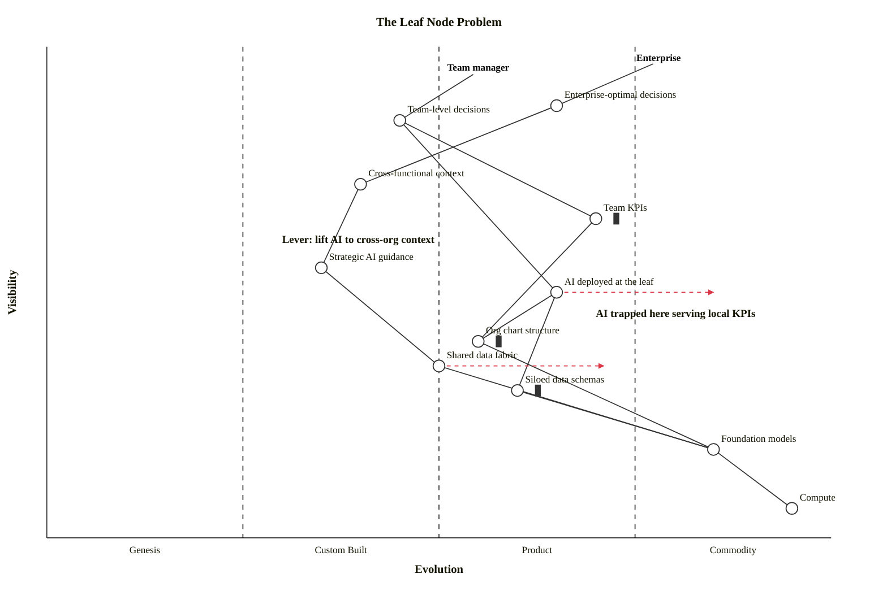

# The Leaf Node Problem: Why Your AI Pilot Is Optimising the Wrong Thing

Most AI pilots in large organisations are funded by a team and accountable to a team. The team has KPIs. The pilot is judged against those KPIs. Six months later there is a write-up showing local improvement, sometimes substantial. The pilot is declared a success and rolled into business as usual.

And the enterprise outcome the company actually cares about does not move.

This pattern is common enough that researchers have a name for it. Valentine, Sergeeva, Tan and Yang published a 2024 study in the *Proceedings of the ACM on Human-Computer Interaction* showing how algorithms deployed inside conventional hierarchical structures end up reinforcing those structures rather than reshaping them. Mar Gonzalez picked it up as Idea 10 of *Organizing Intelligence*, DeepMind's May 2026 collection of frontier AI research that will redefine how organisations build, lead and scale. Both papers are worth reading in full. The architectural shorthand is simpler: **the leaf node problem**.

## What the map shows

If you draw the situation as a Wardley Map, two user anchors appear, both legitimate, both pulling in different directions. The Enterprise anchor wants company-level optimal decisions. The Team manager anchor wants their team's KPIs hit. Each anchor has its own value chain.

Inside the team manager's chain, AI tooling lands close to commodity. It is the most evolved component on the map: vendor platforms, foundation-model APIs, off-the-shelf agent frameworks, evaluation harnesses. That maturity is exactly what makes the trap easy to walk into. You can stand up an AI pilot in a single sprint because the building blocks are right there. The chain serves the team manager's KPIs all the way up. The chain terminates at a dashboard.

Inside the enterprise chain, the equivalent component (call it strategic AI guidance) sits one rung lower in evolution. It depends on cross-functional context, which in turn depends on a shared data fabric. Both of those are typically custom-built or absent. There is no convenient procurement route. There is no team that owns them. Standing the enterprise chain up takes quarters, not sprints.

The Wardley Map makes the asymmetry visible. The leaf chain is easy and ships. The enterprise chain is hard and waits.

## Three points of inertia

Three components on the map carry the inertia decorator, and they all pull the same direction.

**Team KPIs.** They are mature, codified in performance review cycles, tied to compensation. Any AI tool placed above them inherits their gravity. The tool will be tuned, instrumented and judged against those KPIs because that is what the people deploying it are judged against. No amount of strategic narrative changes the slope.

**Org chart structure.** Reporting lines determine who owns the pilot, who funds it, who decides whether to keep it. The team that owns the pilot owns the dependencies the pilot can reach. Anything outside that scope is somebody else's roadmap. The org chart turns the available dependency graph into a bounded subgraph, and the AI is deployed only on what is reachable.

**Siloed data schemas.** Each team has a lake, a warehouse, a schema, a contract. The pilot consumes whichever one is on the team's side of the fence. Cross-team data, even when it technically exists, is gated by sharing agreements, identity reconciliation, ownership disputes. The pilot ends up trained, evaluated and operated on the schema closest to hand, which is rarely the one the enterprise outcome depends on.

Marking these as inertia on the map matters because it makes the gravity legible. Everyone else looking at the map sees the same three forces. Conversations stop being about whether the leaf trap is real and start being about which of the three to address first.

## The architect's question

There is one question that an architect or a governance forum can ask of every proposed AI pilot before it is approved, and the answer is almost always diagnostic.

**Trace the pilot's dependencies on the map. Does the chain terminate in cross-functional context, or in a team's KPI dashboard?**

If it terminates in the dashboard, the pilot may be funding a leaf rather than a lift. That is not automatically a reason to reject it. Local optimisation has value. But the pilot should be approved as a leaf, with leaf-shaped expectations, not as a strategic AI investment. The decision record should say so. The forecast benefit should be local. The escalation route, if local optimisation drifts away from enterprise outcomes, should be explicit.

If it terminates in cross-functional context, the pilot is doing harder work. It will probably need a longer runway, an explicit data-fabric investment, and a sponsor above the team manager line. It is worth approving differently, with different success criteria, on a different cadence.

## What to do this week

Pick the highest-profile AI pilot currently running in your organisation. Sketch a Wardley Map of its dependencies. Mark the inertia points honestly: which KPIs, which reporting lines, which schemas are doing the pulling. Trace the chain back to the anchor. If the anchor is the team manager, you have just confirmed a leaf. If the anchor is the enterprise, you have a lift candidate but you can also see what the lift actually costs.

Then look at the next pilot in the pipeline. Ask the question before approval, not after delivery.

The leaf node problem is not solved by exhortation or by strategic narrative. It is solved by being honest about what the dependency graph looks like and what the inertia is pulling against. The map is one way to make that honesty visible to everyone in the room.

## Try it

ArcKit's `/arckit:wardley` command outputs both an OnlineWardleyMaps block and a Mermaid `wardley-beta` block, so this map lives in the same pull request as the AI pilot's design document. Diff the inertia. Review the chain. Browse the source at [arckit.org](https://arckit.org).

## Source

Valentine, M. A., Sergeeva, A., Tan, S., & Yang, D. (2024). *The Algorithm and the Org Chart: How Algorithms Can Conflict with Organizational Structures*. Proceedings of the ACM on Human-Computer Interaction, 8(CSCW2), 1 to 31. https://doi.org/10.1145/3686903

Gonzalez, M. (May 2026). *Organizing Intelligence: 16 big ideas from frontier AI research that will redefine how we build, lead, and scale*, Google DeepMind, Idea 10.

<!-- arckit:related-articles -->
## Related Articles

- [The Toolkit Drafts. The Architect Judges.](article-viewer.html?a=2026-04-30-toolkit-drafts-architect-judges)
- [How ArcKit Is Quietly Destroying a Billion-Pound Consulting Business](article-viewer.html?a=2026-04-20-consulting-deliverable-is-dead)
- [Launching ArcKit FDE: Embedded Architects for UK Public Sector](article-viewer.html?a=2026-05-12-arckit-fde-launch)
- [The CAIO's First 90 Days: Delivering the UAE Cabinet AI Mandate](article-viewer.html?a=2026-04-30-uae-caio-first-90-days)

<!-- arckit:community-block -->
## Join the ArcKit Community

- **Discord** — real-time conversation, help with commands, and what people are building: [discord.gg/HsA4Y3hQ4](https://discord.gg/HsA4Y3hQ4)
- **LinkedIn Group** — announcements, case studies, and longer-form discussion: [linkedin.com/groups/17641034](https://www.linkedin.com/groups/17641034/)
- **GitHub** — code, issues, and contributions: [github.com/tractorjuice/arc-kit](https://github.com/tractorjuice/arc-kit)
