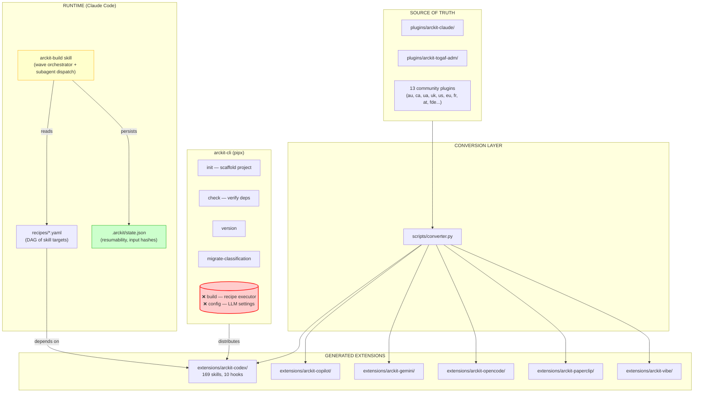

# ArcKit Ecosystem Architecture



## Component Inventory

### Plugins (15 total, 25 commands)

| Plugin | Commands | Recipes | Templates |
|--------|----------|---------|-----------|
| `arckit-claude` | 75 | 4 | — |
| `arckit-togaf-adm` | 9 | 2 | 9 |
| `arckit-au` | 4 | 1 | — |
| `arckit-au-energy` | 6 | 1 | — |
| `arckit-ca` | 4 | 1 | — |
| `arckit-uae` | 6 | 2 | — |
| `arckit-uk-gcloud` | 8 | 1 | — |
| `arckit-uk-nhs` | 6 | 1 | — |
| `arckit-uk-finance` | 5 | 1 | — |
| `arckit-us` | 4 | 1 | — |
| `arckit-eu` | 3 | 1 | — |
| `arckit-fr` | 3 | 1 | — |
| `arckit-at` | 3 | 1 | — |
| `arckit-fde` | 2 | 1 | — |
| `arckit-agent-architecture` | 2 | 1 | — |

### Extensions (6 generated)

| Extension | Skills | Hooks | Status |
|-----------|--------|-------|--------|
| `arckit-codex` | 169 | 10 | ✅ Primary output |
| `arckit-copilot` | 4 | 3 | Lightweight mirror |
| `arckit-gemini` | 4 | 3 | Lightweight mirror |
| `arckit-opencode` | 4 | 3 | Lightweight mirror |
| `arckit-paperclip` | 4 | 3 | Lightweight mirror |
| `arckit-vibe` | 4 | 3 | Lightweight mirror |

### CLI (`arckit-cli` v6.1.1)

| Command | Description | Status |
|---------|-------------|--------|
| `init` | Scaffold project directory + copy skills/hooks | ✅ Working |
| `check` | Verify required tools installed | ✅ Working |
| `version` | Show version | ✅ Working |
| `migrate-classification` | UK→UAE classification migration | ✅ Working |
| `build` | Execute recipe against project | ❌ **Missing** |
| `config` | LLM + project configuration | ❌ **Missing** |

### Recipe System

| Recipe | Plugin | Targets | Waves |
|--------|--------|---------|-------|
| `uk-saas` | `arckit-claude` | 35 | 9 |
| `uk-mod-sovereign` | `arckit-claude` | 35 | 9 |
| `uk-nhs-clinical-safety` | `arckit-claude` | 44 | 8 |
| `togaf-adm-full` | `arckit-togaf-adm` | 13 | 5 |
| `togaf-agent-full` | `arckit-togaf-adm` | 12 | 4 |
| `au-federal` | `arckit-au` | 35 | 9 |
| `au-energy` | `arckit-au-energy` | 22 | 7 |
| `uae-federal-ai` | `arckit-uae` | 28 | 8 |
| `uae-agentic-transformation` | `arckit-uae` | 24 | 6 |
| `ca-federal-fitaa` | `arckit-ca` | 22 | 7 |
| `agent-architecture` | `arckit-agent-architecture` | 15 | 5 |
| + 12 more | various | — | — |

**Total: 24 recipes across all plugins**

## Data Flow

```
plugins/arckit-togaf-adm/commands/*.md
    → scripts/converter.py
    → extensions/arckit-codex/skills/arckit-*/SKILL.md  (1:1 mapping)
    → arckit init project --ai codex
    → copies skills to .agents/skills/
    → user opens in Codex/Claude CLI
    → skills execute with LLM + tool calls
```

## Key Gap

**`arckit build` / `arckit config` are not in CLI.** Recipe execution lives entirely in Claude Code via `arckit-build` skill. No CLI-native execution path exists.