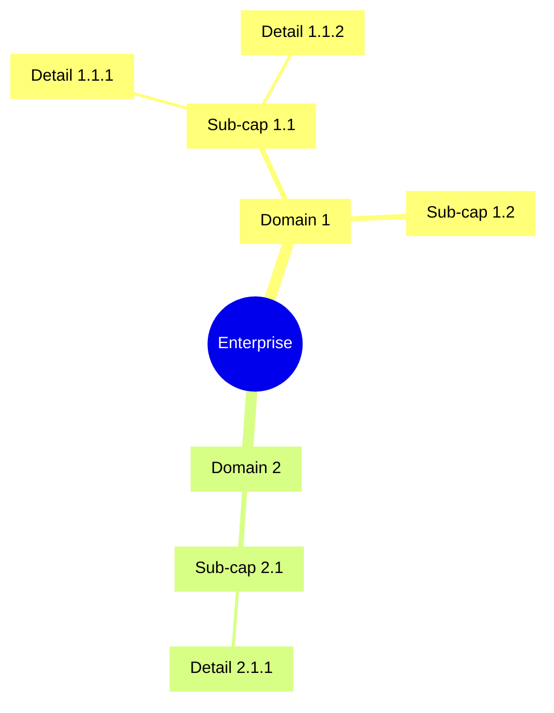
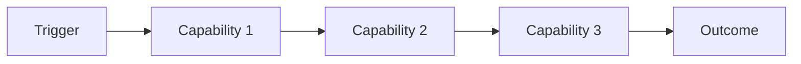
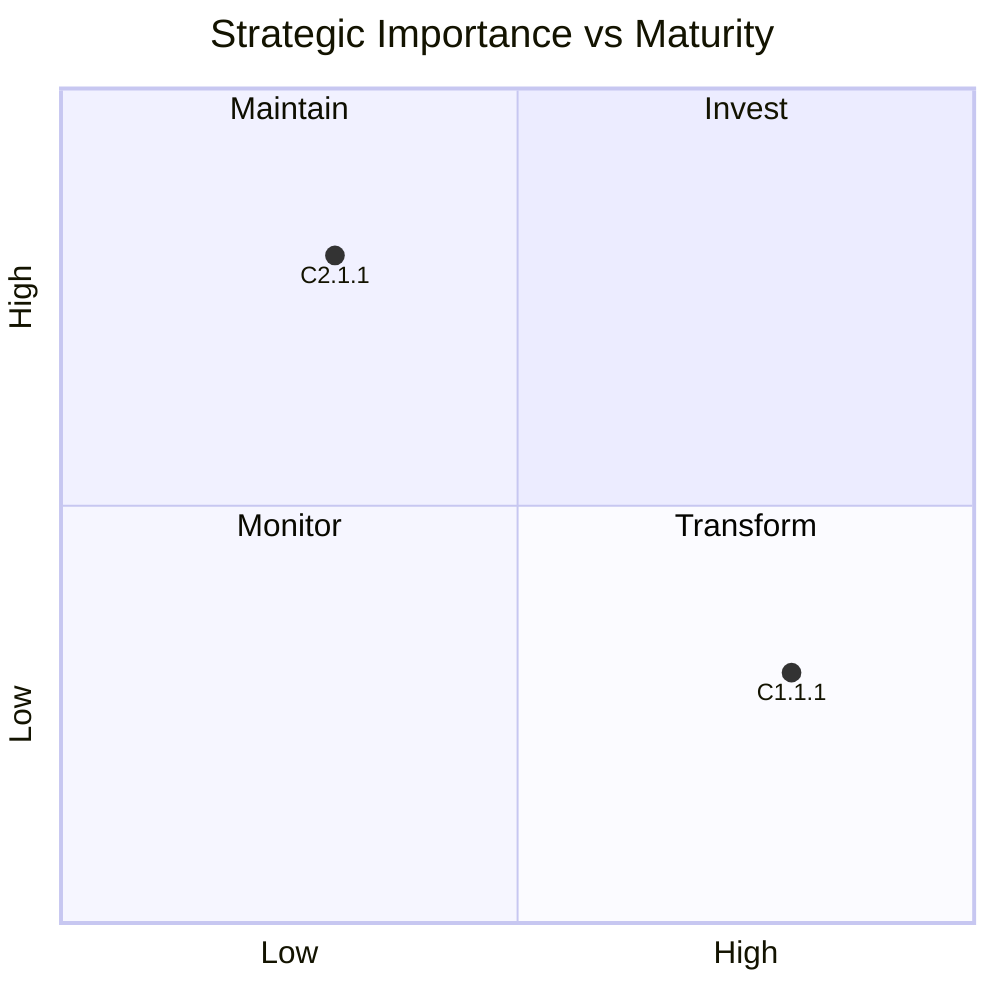

# Business Capability Map

## Intake Interview Questions

The template-driven intake interview asks the questions below before rendering this
artefact. Every question below is always put to the user for their input, one
question at a time, and is prefilled where answerable from existing artefacts,
saved intake, onboarding data, or organisation config so the user can confirm or
override it. Each question is **optional**: a skipped question renders as a
`TBD` marker in the artefact. Sources: TOGAF Standard, 10th Edition
(discovery dimensions per ADM phase) and the O-AA / agentic outcome dimensions below.

### Intake questions (TOGAF 10 — ADM Phase B)

- **Business outcomes:** Which strategic goals or outcomes must the target capability model enable?
- **Current capabilities:** Which business capabilities exist today, at what maturity, and which are obsolete?
- **Gaps:** Which capabilities are needed to reach the target state but are missing or weak?
- **Value stream:** Which value-stream steps (customer journey stages) do the capabilities serve?
- **Target state:** What are the target capability layers (strategic / business / shared / enabling) and their owners?

## Document Control

| Field | Value |
|-------|-------|
| Document ID | `ARC-[PROJECT_ID]-BPCM-v[VERSION]` |
| Document Type | Business Capability Map |
| Project | `[PROJECT_NAME]` |
| Classification | `[CLASSIFICATION]` |
| Status | DRAFT |
| Version | `[VERSION]` |
| Created Date | `[YYYY-MM-DD]` |
| Last Modified | `[YYYY-MM-DD]` |
| Review Cycle | Monthly during active ADM cycle |
| Next Review Date | `[YYYY-MM-DD]` |
| Owner | `[OWNER_NAME_AND_ROLE]` |
| Reviewed By | `[REVIEWER_NAME]` |
| Approved By | `[APPROVER_NAME]` |
| Distribution | `[DISTRIBUTION_LIST]` |
| Created | `[YYYY-MM-DD]` |
| Review Date | `[YYYY-MM-DD]` |

### Revision History

| Version | Date | Author | Description | Reviewer | Approver |
|---------|------|--------|-------------|----------|----------|
| `[VERSION]` | `[YYYY-MM-DD]` | ArcKit AI | Initial creation | `[REVIEWER_NAME]` | `[APPROVER_NAME]` |

---

## 1. Capability Hierarchy

### Level 1: Capability Domains

| Domain ID | Domain | Description |
|-----------|--------|-------------|
| C1.0 | [Domain] | [Description] |

### Level 2: Sub-Capabilities

[For each domain, list sub-capabilities]

### Level 3: Detailed Capabilities

[For each sub-capability, list detailed capabilities]

### Capability Map (Mermaid mindmap)



## 2. Value Streams

### Value Stream Matrix

| Value Stream | Capabilities | Trigger | Outcome |
|--------------|--------------|---------|---------|
| [VS-001] | [C1.1, C2.3, C3.1] | [Trigger] | [Outcome] |

### Value Stream Flow



## 3. Capability Maturity Assessment

| Capability | Current (L1-L5) | Target (L1-L5) | Gap | Priority |
|------------|----------------|---------------|-----|----------|
| [C1.1.1] | [L2] | [L4] | [Gap] | [High/Med/Low] |

## 4. Capability Heatmap



## 5. Capability-Requirement Traceability

| Requirement | Capability | Coverage |
|-------------|------------|----------|
| BR-001 | [C1.1.1] | [Full/Partial/Gap] |

## 6. Capability-Principle Alignment

| Principle | Related Capabilities | Alignment |
|-----------|---------------------|-----------|
| [PRIN-01] | [C1.1.1, C1.2.1] | [Aligned/Partial] |

## 7. Traceability

| Source | Artifact | Link |
|--------|----------|------|
| ADM Preliminary | `ARC-[P]-ADMP-v[N].md` | [Direct] |
| Requirements | `ARC-[P]-REQ-v[N].md` | [Direct] |
| Stakeholders | `ARC-[P]-STKE-v[N].md` | [Direct] |
| Principles | `ARC-000-PRIN-v[N].md` | [Direct] |

---

**Generated by**: ArcKit `/arckit-togaf-adm:business-capability-map` command
**Generated on**: `[DATE] [TIME] GMT`
**ArcKit Version**: `{ARCKIT_VERSION}`
**Project**: `[PROJECT_NAME]` (Project `[PROJECT_ID]`)

## PlantUML ArchiMate View

**Layer focus**: Business / Capability

> Notation: PlantUML ArchiMate standard library — pinned `!include <archimate/Archimate>` (PlantUML 1.2026.8).
> This view is additive; the Mermaid diagram(s) above are unchanged.

```plantuml
@startuml
!include <archimate/Archimate>

title {diagram_title}

LAYOUT_TOP_DOWN()

' Elements
{plantuml_elements}

' Relationships (realization concrete->abstract; serving/flow/access)
{plantuml_relationships}

' Layout constraints (hidden placement edges)
{plantuml_layout}

@enduml
```

**View this diagram** (PlantUML does NOT render in GitHub markdown):

- **CLI**: `java -jar plantuml.jar <file>.puml`
- **Public server**: https://www.plantuml.com/plantuml/uml/ (keep the view small; never inline the stdlib into the URL source)
- **Notation reference**: `skills/plantuml-syntax/references/archimate.md`
- **Artefact delivery**: the view is shipped as a rendered **self-contained `.svg`** (offline, pinned build `plantuml-1.2026.8.jar -tsvg`; no external URLs, fully offline-openable); the inline PlantUML source above is retained as the source of truth.

## Capability Map (ArchiMate View)

**Layer focus**: Strategy / Capability (hierarchical capability map)

> This dedicated view renders the capability **hierarchy** (L1 domains → L2
> sub-capabilities → optional L3 detailed capabilities) as an ArchiMate
> Strategy-layer view. It is **additive**: the Mermaid mindmap and the
> capability→target realization view above are unchanged.
>
> Notation: PlantUML ArchiMate standard library — pinned `!include <archimate/Archimate>` (PlantUML 1.2026.8).
> Whole→part edges use `Rel_Composition(parent, child, "contains")` (or `Rel_Aggregation` where a sub-capability is standalone) and point L1→L2 (whole→part); composition edges are NOT realization edges. `LAYOUT_TOP_DOWN()`; ≤ 12 elements/layer — above the gate, split at a capability-domain boundary into an additional sequenced `ARCH` document.

```plantuml
@startuml
!include <archimate/Archimate>

title {capmap_title}

LAYOUT_TOP_DOWN()

' L1 capability domains, e.g. Strategy_Capability(D1, "Policy & Underwriting")
{capmap_l1_domains}

' L2 sub-capabilities, e.g. Strategy_Capability(D1_1, "Decisioning")
{capmap_l2_subcapabilities}

' L3 detailed capabilities — only when Level 3 is defined; otherwise leave this placeholder empty
{capmap_l3_detailed}

' Whole->part edges, e.g. Rel_Composition(D1, D1_1, "contains"); use Rel_Aggregation if a child is standalone
{capmap_composition_edges}

@enduml
```

**View this diagram** (PlantUML does NOT render in GitHub markdown):

- **CLI**: `java -jar plantuml.jar <file>.puml`
- **Notation reference**: `skills/plantuml-syntax/references/archimate.md` (§ Capability-Map ArchiMate Nesting)
- **Artefact delivery**: the view is shipped as a rendered **self-contained `.svg`** (offline, pinned build `plantuml-1.2026.8.jar -tsvg`; no external URLs, fully offline-openable); the inline PlantUML source above is retained as the source of truth.

## Capability Map — Complexity-Adaptive Regime (choose one)

> Build every capability-map diagram **top-down** (L1 at the top, `LAYOUT_TOP_DOWN()`; a
> parent always reads above its children). The block above (all levels in one
> `@startuml`) is the **flattened / simple** shape. Choose the diagram set from
> the model's complexity — total elements `E` across all present levels (L1 + L2
> [+ L3]) and the widest single level:
>
> - **Simple (`E ≤ 12`) → flatten to one diagram.** Use the block above as-is
>   (a single top-down view of every present level).
> - **Complex (`E > 12`, or any single level denser than ~12 elements) → abstract
>   level-by-level, one diagram per refinement.** Do not cram it into one box:
>   1. an **abstract overview** (top level only — the L1 domains, each with its
>      child count as a roll-up);
>   2. **refinement** diagrams, one **per L1 domain** (that domain's L2 sub-hierarchy
>      and its L3 detail when defined). Each refinement is a separate sequenced
>      `ARCH` document gated to ≤ 12 elements/layer; refine further per sub-domain
>      if still dense — never silently drop.
>
> Cross-link abstract ↔ refinement in Linked Artifacts; each renders to a
> self-contained `.svg` (pinned `plantuml-1.2026.8.jar -tsvg`, offline).

### Abstract overview (complex regime, top level only)

```plantuml
@startuml
!include <archimate/Archimate>

title {capmap_overview_title}

LAYOUT_TOP_DOWN()

' L1 domains only, each labelled with its child count, e.g. Strategy_Capability(D1, "Policy & Underwriting (4 sub-caps)")
{capmap_overview_domains}

@enduml
```

### Refinement (complex regime, one per L1 domain)

One `@startuml`/`@enduml` per L1 domain, each a separate sequenced `ARCH` document
(drill that domain's L2 sub-hierarchy + L3 detail when defined). Keep each ≤ 12
elements/layer; split the densest domain per sub-domain if needed.

```plantuml
@startuml
!include <archimate/Archimate>

title {capmap_refinement_title}

LAYOUT_TOP_DOWN()

' this L1 domain + its L2 children (+ L3 when defined)
{capmap_refinement_domain}

' whole->part edges for this domain only
{capmap_refinement_edges}

@enduml
```
