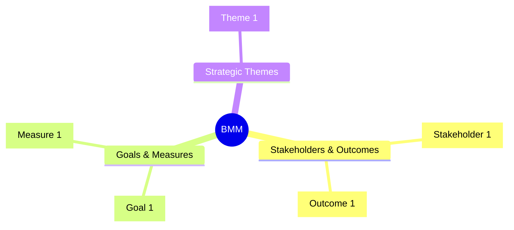

# BMM Model: [TITLE]

> **Template Origin**: Official | **ArcKit Version**: [VERSION] | **Command**: `/arckit:bmm`

## Document Control

<!-- DOC-CONTROL-HEADER -->
<!-- Resolved at command-execution time to _partials/document-control-uk.md or _partials/document-control-uae.md (the 14-field Document Control block) based on plugin userConfig classification_scheme + governance_framework. See _partials/RENDERING.md (when present). -->

## Revision History

| Version | Date | Author | Changes | Approved By | Approval Date |
|---------|------|--------|---------|-------------|---------------|
| [VERSION] | [DATE] | ArcKit AI | Initial creation from `/arckit:bmm` command | [PENDING] | [PENDING] |

---

## 1. Stakeholders & Outcomes

Stakeholders (inherent and desired) and the outcomes that matter to each. One stakeholder may expect several outcomes; one outcome may matter to several stakeholders.

| Stakeholder | Type | Outcome | Outcome description |
|-------------|------|---------|---------------------|
| [Stakeholder 1] | Inherent / Desired | [Outcome 1] | [Description] |

**Stakeholder–Outcome Matrix** (rows = stakeholders, columns = outcomes; ● = the outcome matters to this stakeholder):

| Stakeholder | [Outcome 1] | [Outcome 2] | [Outcome 3] |
|-------------|-------------|-------------|-------------|
| [Stakeholder 1] | ● |  | ● |
| [Stakeholder 2] |  | ● |  |

Conflicts and divergent expectations are made explicit here — a stakeholder row with no ● is an orphan and must be justified or dropped.

## 2. Outcomes → Goals → Objectives → Measures

The motivation ladder. Every outcome has ≥ 1 goal; every goal ≥ 1 objective; every objective ≥ 1 measure (gate G1).

| Outcome | Goal | Objective (specific, measurable, time-bound) | Measure (target / current) |
|---------|------|----------------------------------------------|----------------------------|
| [Outcome 1] | [Goal 1] | [Objective 1] | [Measure 1] |

## 3. Drivers

Forces pushing toward the outcomes and goals. Type each driver: Inherent, Desired, or Imposed; internal or external.

| Driver | Type | Scope | Drives (outcome / goal) | Rationale |
|--------|------|-------|-------------------------|-----------|
| [Driver 1] | Inherent / Desired / Imposed | Internal / External | [Outcome / Goal] | [Why it pushes] |

## 4. Assumptions

Beliefs the case relies on, accepted without proof. Assumptions are listed, never implicit; each states who accepted it and when it should be re-tested.

| Assumption | Accepted by / date | Re-test trigger |
|------------|--------------------|-----------------|
| [Assumption 1] | [Name / date] | [Condition that invalidates it] |

## 5. Case For / Case Against

The documented set of reasons supporting the strategic option, and the documented counter-case. An empty counter-case fails gate G2.

**Case For**

- [Reason 1]
- [Reason 2]

**Case Against**

- [Counter-argument 1]
- [Counter-argument 2]

## 6. Impact Factors

Elements that influence the strength of the case for or against (risk, cost, regulatory shift, …). Each states direction (strengthens / weakens which case) and magnitude.

| Impact factor | Direction | Strengthens / weakens | Magnitude | Source |
|---------------|-----------|-----------------------|-----------|--------|
| [Factor 1] | Strengthens / Weakens | Case For / Case Against | Low / Medium / High | [Source] |

## 7. Strategic Themes → Capabilities → Courses of Action → Resources

Strategic themes are named, high-priority directions; each realizes ≥ 1 capability (gate G3 — in-model link or BPCM cross-reference). Capabilities nest whole → part (L1 → L2 → optional L3). Courses of action are the concrete plans; resources are the assets assigned to them.

| Strategic theme | Capability (L1 / L2 / L3) | Course of action | Resource |
|-----------------|---------------------------|------------------|----------|
| [Theme 1] | [Capability 1] | [Course of action 1] | [Resource 1] |

## 8. Traceability

Links to the sibling artefacts this model consumes and that consume it, plus external strategy documents.

| Artefact / source | Relationship |
|-------------------|--------------|
| [ARC-{P}-STKE-v1.0] | Stakeholders & outcomes consumed from STKE |
| [ARC-{P}-SOBC-v1.0] | 5-case ↔ Case sections (UK regime) |
| [ARC-{P}-STRAT-v1.0] | Strategic themes feed the strategy narrative |
| [ARC-{P}-ROAD-v1.0] | Courses of action feed the roadmap |
| [ARC-{P}-BPCM-v1.0] | Capability cross-reference |
| [external/strategy-doc.md] | Cited per citation-instructions |

### External References

| Doc ID / URL | Title | Cited in |
|--------------|-------|----------|
| [Source 1] | [Title] | [Section] |

## 9. Mermaid Mindmap

Companion mindmap of the whole model (GitHub-renders; PlantUML views are the projections in `diagrams/`). This block is **append-only** on regeneration — extend the tree, never rewrite existing branches.

---

**Generated by**: ArcKit `/arckit:bmm` command
**Generated on**: [DATE]
**ArcKit Version**: [VERSION]
**Project**: [PROJECT_NAME]
**Model**: [AI_MODEL]
